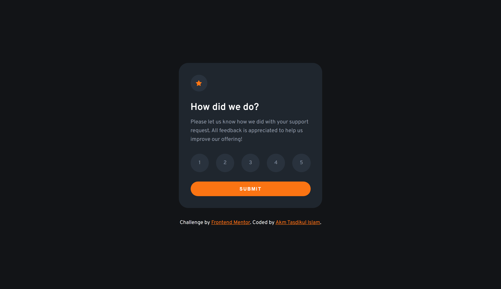
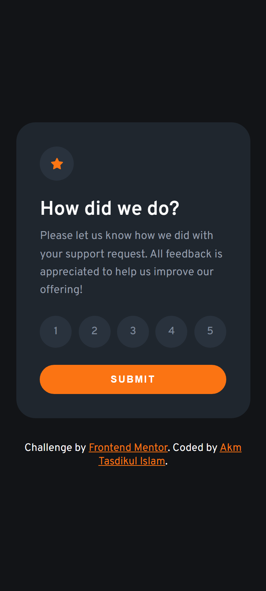

# Frontend Mentor - Interactive rating component solution

This is a solution to the [Interactive rating component challenge on Frontend Mentor](https://www.frontendmentor.io/challenges/interactive-rating-component-koxpeBUmI). Frontend Mentor challenges help you improve your coding skills by building realistic projects.

## Table of contents

- [Overview](#overview)
  - [The challenge](#the-challenge)
  - [Screenshot](#screenshot)
  - [Links](#links)
- [My process](#my-process)
  - [Built with](#built-with)
  - [What I learned](#what-i-learned)
  - [Useful resources](#useful-resources)
- [Author](#author)

## Overview

- Project Start Date: 17 April 2024
- Project Duration: 04 Hours

### The challenge

Users should be able to:

- View the optimal layout for the app depending on their device's screen size
- See hover states for all interactive elements on the page
- Select and submit a number rating
- See the "Thank you" card state after submitting a rating

### Screenshot

| Desktop Version                        | Mobile Version                        |
| -------------------------------------- | ------------------------------------- |
|  |  |

### Links

- [Solution URL](https://github.com/akmtasdikulislam/interactive-rating-component)
- [Live Site URL](https://akmtasdikulislam.github.io/interactive-rating-component/)

## My process

- At first, I linked the `style.css` file and the Google Fonts CDN with `index.html`.
- Then, imported the colors from `style-guide.md` into the `style.css` file. After that, I initialized the css file and set necessary parameters (such as, font-families, colours, font-sizes etc.) for this project.
- Then, I wrote necessary code to reach the given _UI Design Sample_ and also added necessary css styles to match it with the _UI Design Sample_.
- After that, I wrote the necessary CSS MEDIA QUERIES for mobile device view of this project.
- Finally, I wrote necessary `javascript` codes to select ratings, submit ratings and also show "Thank You" state.

### Built with

- Semantic HTML5 markup
- CSS custom properties
- Flexbox

### What I learned

By doing this project I learned how to create a rating feedback component.

### Useful resources

- [JavaScript Array find()](https://www.programiz.com/javascript/library/array/find) - This helped me to know how to use find() mtehod on an array in javascript.

- [Four Different Ways to Search an Array in JavaScript](https://www.freecodecamp.org/news/4-methods-to-search-an-array/) - This helped me to know how to use find() mtehod on an array in javascript.

- [Four Different Ways to Search an Array in JavaScript](https://www.freecodecamp.org/news/4-methods-to-search-an-array/) - This helped me to match UI with the provided _UI Design Sample_

## Author

- Frontend Mentor - [@akmtasdikulislam](https://www.frontendmentor.io/profile/akmtasdikulislam)
- Twitter - [@Akm_Tasdikul](https://www.twitter.com/Akm_Tasdikul)
